# Flutter Chat App

A feature-rich chat application built using **Flutter** with **Firebase** integration and utilizes **Riverpod** for state management. This app allows users to authenticate with their mobile number, enabling them to chat with their contacts, share emojis, GIFs, images, videos, and audio recordings. It also supports group chat functionality, along with both person-to-person and group video calling. Users can set profile pictures, view online/offline status, and see real-time message timestamps. Additionally, users can add statuses, similar to WhatsApp.

---

## Features

- **Firebase Authentication:** Secure and efficient mobile number authentication to onboard users.
- **Firebase Storage:** Store and retrieve images, videos, and audio files.
- **Firestore Database:** Real-time chat functionality and user data storage.
- **Contact Import:** Connect with your mobile contacts who are also using the app.
- **Emojis & GIFs:** Express yourself with a wide range of emojis and share GIFs in your chats.
- **Image & Video Sharing:** Share images and videos with ease.
- **Profile Pictures:** Set your profile picture for others to see.
- **Online/Offline Status:** Know when your contacts are online or offline.
- **Real-Time Message Status:** See when messages are sent or received in real-time.
- **Dark & Light Themes:** Choose between dark and light themes for a personalized experience.
- **Search Functionality:** Easily find and start conversations with your contacts.

---

## Screenshots

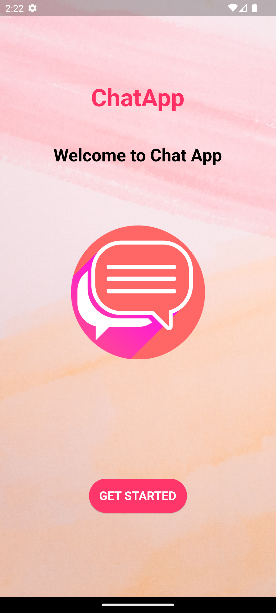

| 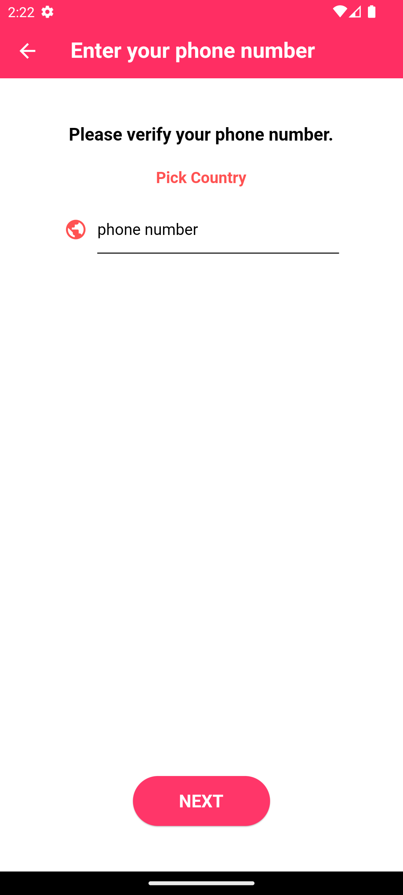 |  | 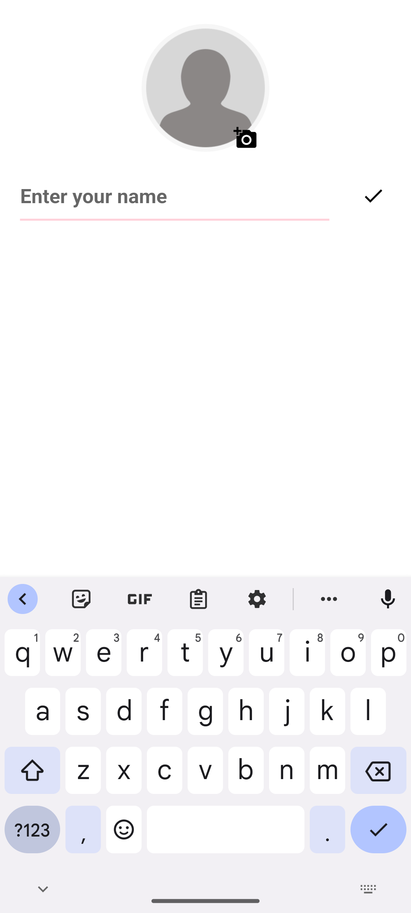 |
| :---------------------------: | :---------------------------: | :---------------------------: |
|       **Login Screen**        |       **OTP Screen**        |       **Create Profile**        |
| 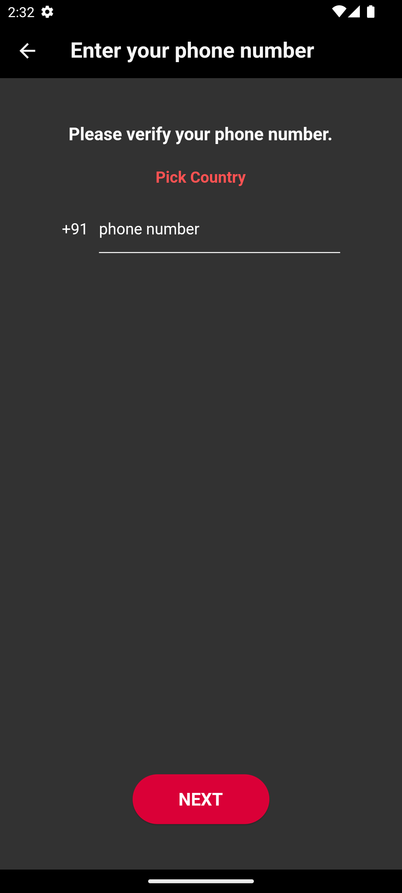 |  | 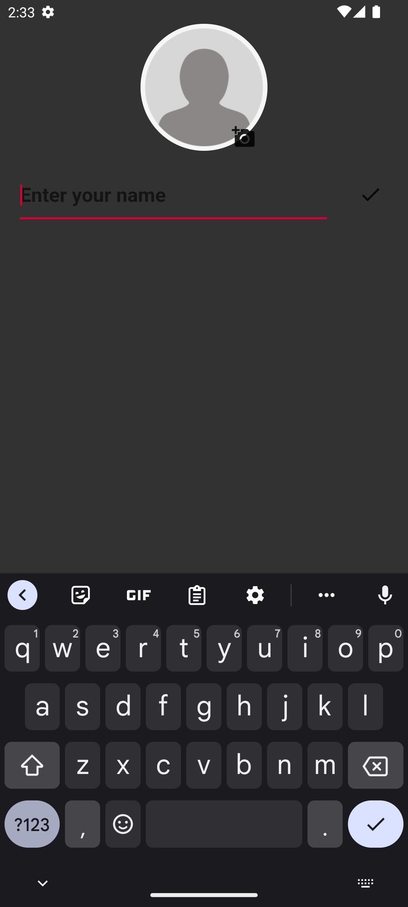 |

---

| 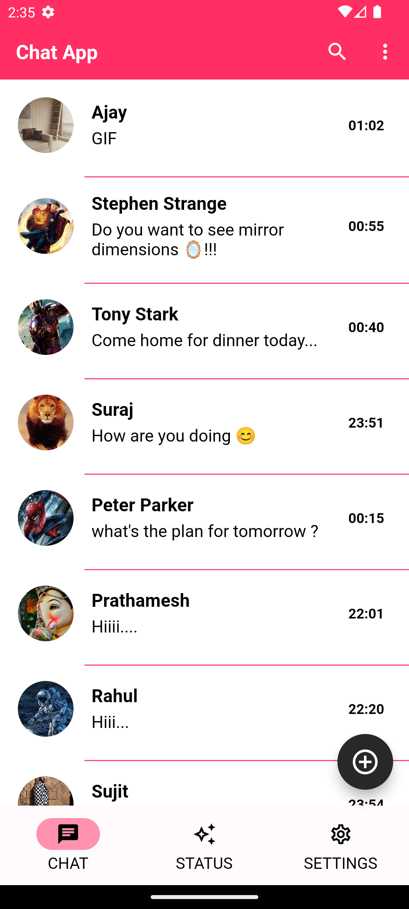 | 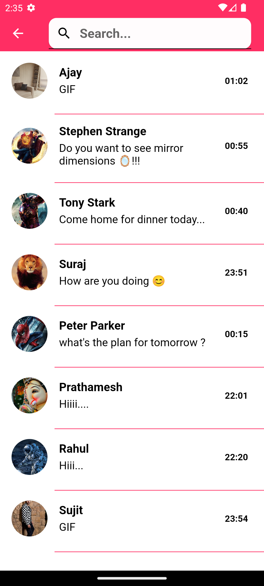 | 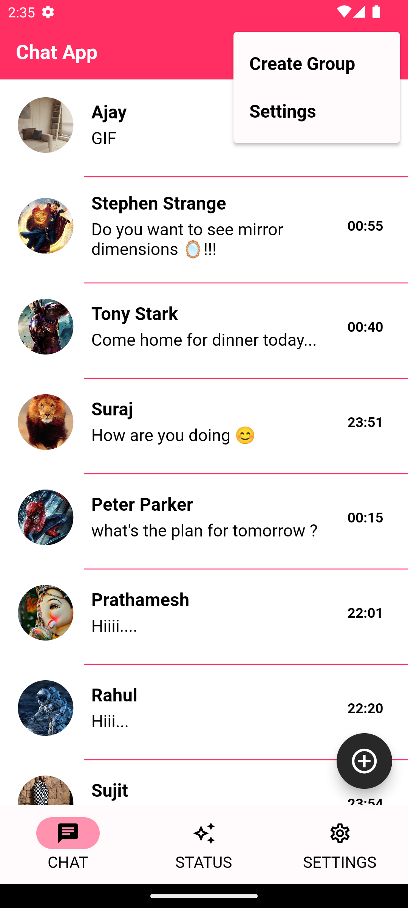 |
| :---------------------------: | :---------------------------: | :---------------------------: |
|       **Home Screen**        |       **Search Screen**        |       **Pop Menus**        |
| 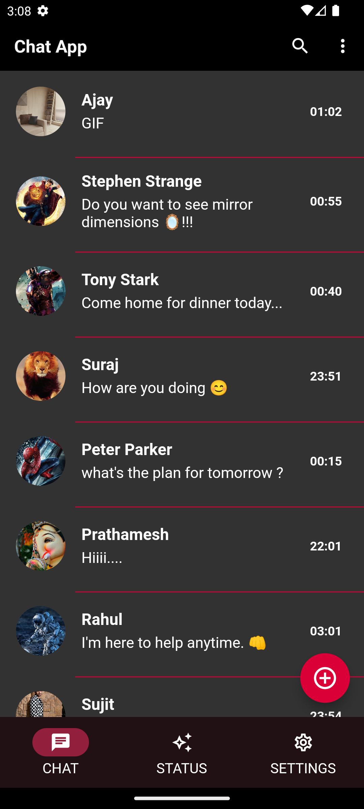 | 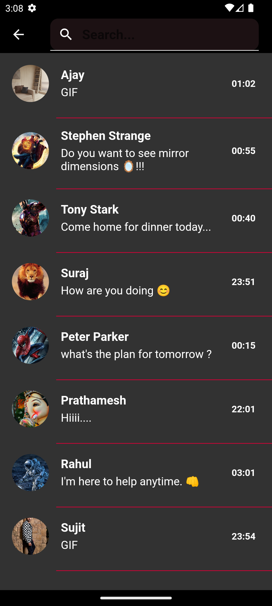 | 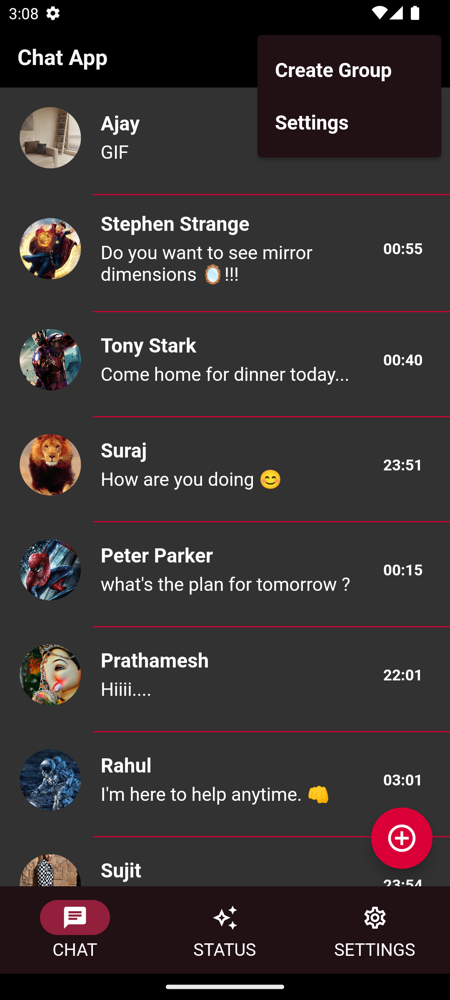 |

---

| 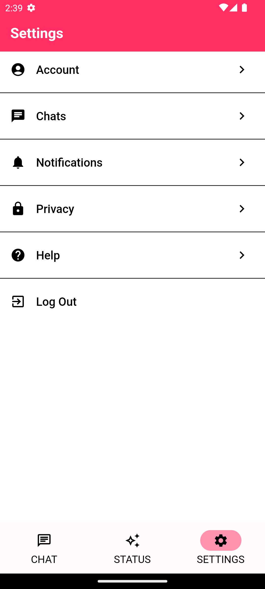 | 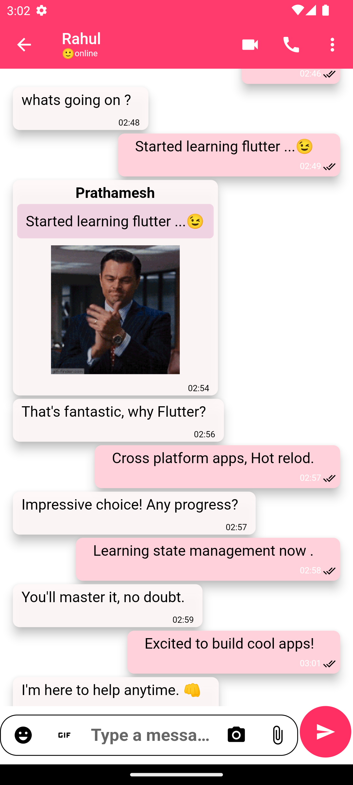 |
| :---------------------------: | :----------------------------: |
|       **Settings Screen**     |        **Chat Screen**         |
| 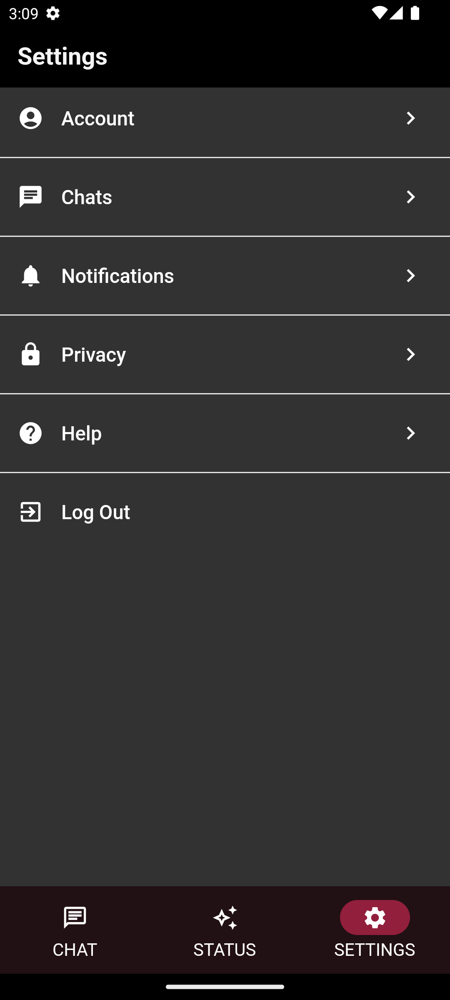 | 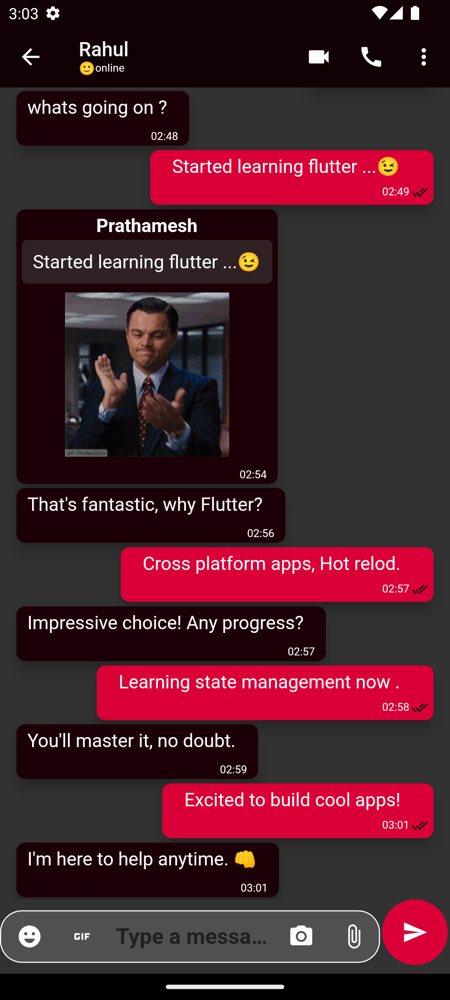 |

---

## Planned Enhancements

This app serves as a foundation for further development, with future updates expected to introduce additional features, optimizations, and UI/UX improvements. Planned enhancements include:

- **Message Reactions**: Users will have the ability to react to messages with emojis.

- **Voice Messages**: Implementation of voice messaging capabilities for added versatility in communication.

- **Notification Integration**: Push notifications will be integrated to alert users of new messages or call requests.

- **Message Editing/Deleting**: Users will have the ability to edit or delete messages within a specified timeframe.

- **User Authentication Enhancements**: Implementation of additional authentication methods for enhanced security.

- **Multi-Language Support**: Localization features will be added to accommodate users from different linguistic backgrounds.

---

## Tech Stack

The app leverages a variety of technologies to provide a rich and interactive user experience:

- **Flutter**: The cross-platform framework for building mobile applications.

- **Firebase**: Firebase authentication, Firebase storage, and Firestore are for user management, storage, and real-time database functionality.

- **Agora Video Calling**: Integrated for high-quality video calls, supporting both one-on-one and group video calling.

- **Riverpod**: A state management library for Flutter, ensuring a well-structured and efficient app architecture.

---

## Contributions

Contributions are welcome! Feel free to submit a pull request if you'd like to enhance the app or add new features.
